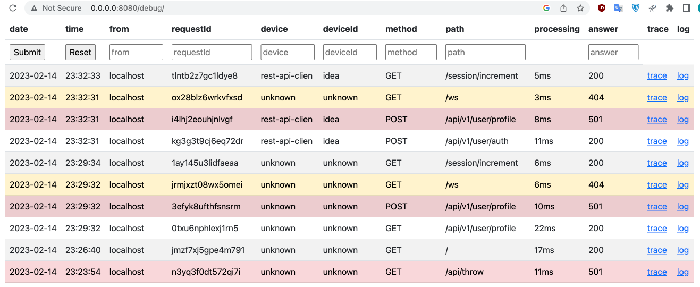

# Ktor for education

## Включет

1. Раздельный лог запросов
2. Дебаг парель для просмотра отедльного запроса
3. Микро апи на yaml
4. Авторизация по jwt с указанием user id
5. idea rest client
6. Эксепшны в формате json

### Micro api

#### idea rest client

#### Роуты

##### Авторизация

##### Получение профиля

### Debug for education
#### Раздельные логи запросов

#### Просмотр тела запроса

#### Просмотр лога запроса

#### Дашборд запросов

#### Корфигурация дебагерв
